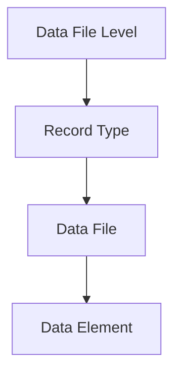
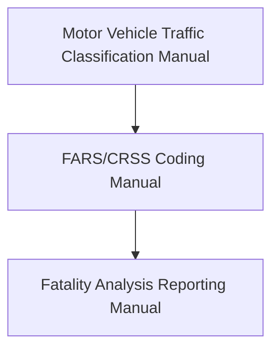

This interactive guide exists to make working with the Fatality Analysis Reporting System Analytical User's Manual, 1975-2023 easier. 
### How does this make using the manual easier?

By applying Piercean visual design principles. 

Namely through:
- Broad level reformatted overview documentation
- Interactive reference tables with links for quick comparison and link reference
- Interactive network graphs to organize and explore documents

### How is this website structured?

There are 4 different folders that consist of the 4 different hierarchical categories that exist in the FARS data.

The following diagram shows this structure:

### How do I get started?

You can start with the [overview documentation](overview-doc.md).

---
#### Additional Notes

Definitions for the FARS User's Manual are, more or less, defined top-down according to the following references:

